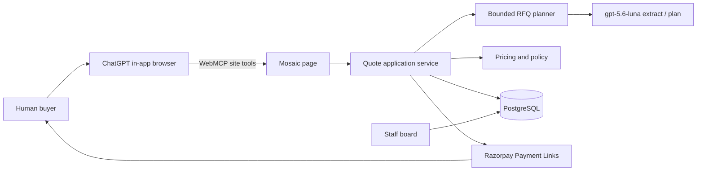

# QuoteRail

Razorpay AI Buildathon · Track 01: AI Growth & Agentic Commerce.

**QuoteRail turns complex corporate-event enquiries into feasible, reservable, policy-compliant Razorpay checkouts, while preventing buyer agents from manipulating price, availability, or payment state.**

This is a merchant-side system for **Mosaic Events Bengaluru**. The public house is bookable by a purchasing agent. The recorded demo opens Mosaic in **ChatGPT’s in-app browser**, which discovers **WebMCP site tools** on the page. QuoteRail is not another shopping agent and not Razorpay’s official MCP — it reasons over venue constraints, then lets deterministic code own price, capacity, policy, and payment state.

## How an agent books

ChatGPT (GPT-5.6 Sol or Terra) opens this origin. The page registers the same nine tools on `document.modelContext`. The agent calls those tools in the tab. It should not invent HTTP GET/POST, and it should not ask the human for an API token. Luna currently has WebMCP disabled.



After `request_quote`, the tab stores the ticket and later tools send it. After `create_checkout`, the human pays on Razorpay. Mosaic never collects card details.

Site tools (also the remote MCP tool list):

`get_merchant_profile` · `search_venue_services` · `request_quote` · `continue_rfq` · `get_rfq` · `revise_quote` · `accept_quote` · `create_checkout` · `get_transaction_status`

Fallbacks if the agent is not in a WebMCP browser:

- HTTP: `POST /api/enquire` with `{ "request": "..." }`. Keep `ticket`. Send it as `X-Mosaic-Ticket` or JSON `{ "ticket": "..." }`.
- Remote MCP: `POST /api/mcp` (OpenCode and similar). Enquire works without a bearer; later calls use the returned ticket.
- Machine contract: `/.well-known/agent-commerce.json` and `/llms.txt`.

## Safety invariants

- The model never sets prices, availability, or payment amounts.
- Checkout amounts come only from an immutable accepted quote.
- Webhooks are authoritative only after HMAC verification.
- Offered alternatives do not reserve capacity; acceptance does, for 24 hours.
- Approval ceilings always use the full quote total, even for a 40% deposit.

## Setup

Node 22, pnpm, Docker.

```bash
corepack enable
pnpm install
cp .env.example .env
docker compose up -d
pnpm db:migrate
pnpm db:seed
pnpm dev
```

Open `/` or `/agent` in a WebMCP-capable browser to see the site tools. `Origin-Agent-Cluster: ?1` is set on responses so native WebMCP can run.

## Tests

```bash
pnpm typecheck
pnpm lint
pnpm test
pnpm test:integration
pnpm test:e2e
pnpm eval
```

`pnpm eval` runs the 30 labeled RFQs through the fake planner and writes `docs/EVALS.md`. Live OpenCode Go evals need `OPENCODE_GO_API_KEY` and are opt-in.

Real Razorpay calls require `REAL_RAZORPAY_TESTS_ENABLED=true` and test keys. They are never run in CI. Razorpay test mode has a 30 Payment Link quota.

## Remote MCP (OpenCode fallback)

Optional. Locked config:

```json
{
  "$schema": "https://opencode.ai/config.json",
  "mcp": {
    "quoterail": {
      "type": "remote",
      "url": "https://<deployment>/api/mcp",
      "enabled": true,
      "oauth": false,
      "headers": {
        "Authorization": "Bearer {env:QUOTERAIL_BUYER_TOKEN}"
      },
      "timeout": 60000
    }
  }
}
```

Pinned packages: Next.js 16.3.3, `usewebmcp` 5.x, `@modelcontextprotocol/server` 2.0.0, `ai` 7.x, `@ai-sdk/openai` 4.x. OpenCode Go `baseURL` is `https://opencode.ai/zen/go/v1`; the Responses factory posts to `/responses`. Seller model is `gpt-5.6-luna`.

## Limitations

- One merchant, INR, no GST line, no refunds, no remaining-60% collection.
- Credential-gated and not claimed as verified here: live OpenCode Go evals, OpenCode buyer-agent connection, real Payment Link spike, Vercel/Neon deploy, pitch video.
- Local demo uses `FAKE_AI=true` and `FAKE_PAYMENTS=true`.
- No claim of measured conversion uplift.

## License

MIT
