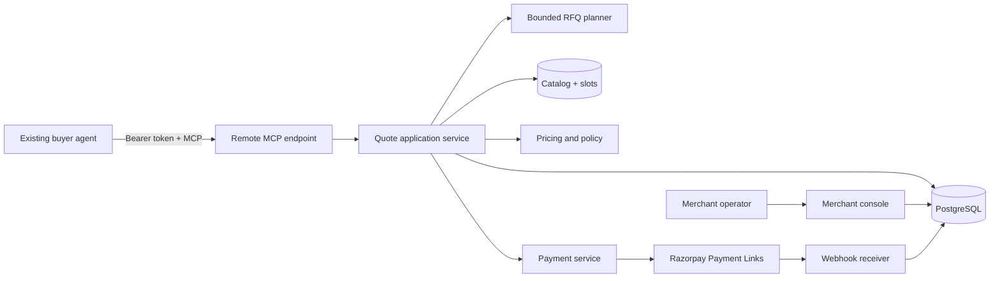
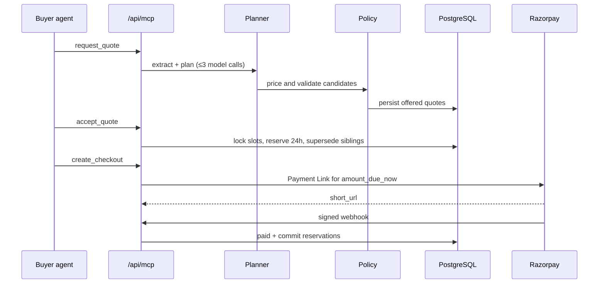

# QuoteRail architecture

QuoteRail is a single Next.js application that makes Mosaic Events Bengaluru transactable by an existing buyer agent. Remote MCP is the buyer interface. Deterministic pricing, availability, and policy code own every money action. Razorpay test-mode Payment Links collect deposits.

## System context

## Request-to-payment sequence

## Trust boundaries

1. Buyer MCP input is untrusted.
2. Model output is untrusted until schema validation and deterministic verification.
3. Merchant costs, margin floors, Razorpay secrets, and blocked-slot reasons are private.
4. Only verified Razorpay webhooks change payment state.
5. Merchant console cookies never authorize MCP tools.

## Model versus policy

| Concern | Model | Deterministic code |
|---|---|---|
| Ambiguous language | Interprets | — |
| Candidate bundles | Proposes | Validates offering codes |
| Price / margin / deposit | Never | Always |
| Availability | Never | Slot + reservation math |
| Discount / approval | May request bps ≤ 1000 | Enforces 5%/10% and 25% margin |
| Razorpay | Never | Adapter + webhooks |

## State machines

RFQ: `received → needs_clarification|planning → quoted|escalated|retryable_error`.

Quote: `draft → offered|pending_approval|policy_rejected`; `offered → accepted|expired|superseded`.

Payment Link: `creating → issued|error`; `issued → paid|cancelled|expired|stopped`. Failed attempts increment `failure_count` without leaving `issued` until the third failure.

## Idempotency and webhooks

Checkout inserts a local `creating` row keyed by acceptance before calling Razorpay. Repeated calls reuse `creating`/`issued` rows. Create timeouts reconcile by deterministic `reference_id`. If lookup is not unique, status becomes `error` with `manual_reconciliation_required`.

Webhooks verify HMAC-SHA256 over the raw body, hash the body for dedup, ignore out-of-order regressions, and commit or release reservations in the same transaction as the payment transition.

## Audit

Append-only `audit_events`. Lifecycle writes and their audit rows share a `trace_id` from RFQ ingress. Merchant console can export sanitized JSON for one RFQ.

## Threat model summary

See `docs/THREAT_MODEL.md`. Residual risk: demo bearer token is static; production would replace it with per-buyer credentials.

## AP2 conceptual mapping

QuoteRail is **not** AP2-compliant. Conceptually:

- RFQ + parsed requirements ≈ intent mandate
- Immutable accepted quote ≈ cart/terms mandate
- Buyer confirmation + Razorpay hosted checkout ≈ payment authorization
- Acceptance hash, policy snapshot, provider reference, and audit events ≈ evidence

## Failure modes

| Failure | Recovery |
|---|---|
| Missing RFQ fields | `needs_clarification` + `continue_rfq` |
| Model timeout | `retryable_error` + same tools |
| No feasible option | `escalated` |
| Payment attempt failed | Same Payment Link, count += 1 |
| Third failure | `stopped`, cancel link, release hold |
| Invalid webhook | 401, no mutation |
| Create timeout | Reconcile by reference or stop |

## Why no generic memory layer

Clarification history is `rfq_messages` scoped to one buyer subject and one RFQ. Latest normalized requirements stay on `rfqs`. A vector store or Mem0 product would add an unbounded trust surface without improving the demo.
